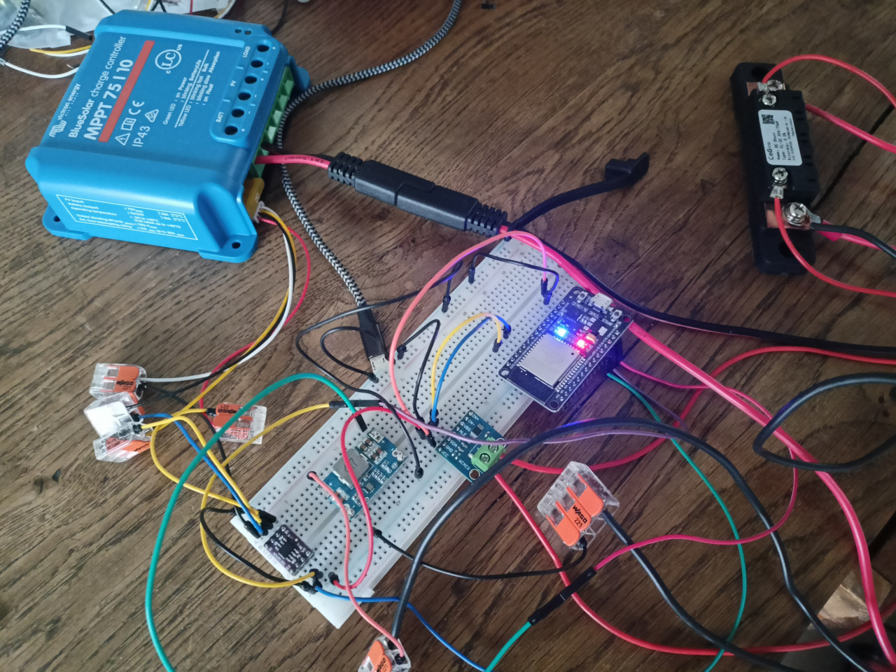

# SensCoulo
 signalk coulomètre ESP32

SensCoulo est un projet de moniteur de batterie 12V pour serveur signalk à partir d'un ESP32. Il fonctionne avec un régulateur solaire MPPT victron avec lequel l'ESP32 communique en liaison série à l'aide [du protocole Ve.direct.](https://www.victronenergy.com/upload/documents/VE.Direct-Protocol-3.32.pdf) 

L'ESP32 renvoie les données issues du MPPT au serveur signalK et initialise la charge compléte de la batterie quand le MPPT est en float.

Le projet a été réalisé avec [platformIO](https://platformio.org), le fichier platformio.ini reprend l'environnement de travail avec les librairies nécessaires.

Le projet est construit à partir du framework [sensESP](https://github.com/SignalK/SensESP) , complété de sa librairie [VEDirect](https://github.com/SensESP/VEDirect) et de la librairie [INA226Lib](https://github.com/peterus/INA226Lib)

## Matériel

- ESP32
- Mini 560 : module régulateur de tension DC-DC 12V-5V pour alimenter l'ESP32 depuis le circuit 12V de la batterie 
- Shunt : pour le projet est utilisé un shunt 75mv 30A [CG FL2C](http://www.cnchog.com/products/10a-50a-ID137.html)
- INA226 : il faudra dessouder la résistance shunt intégrée au module pour utiliser le module avec le shunt extérieur.
- ADUM1201 : isolateur magnétique pour isoler la connexion série entre l'ESP32 et le MPPTvictron. **Attention les GPIO de l'ESP32 sont en 3V et le MPPT en 5V** en plus d'isoler l'ADUM1201 effectue la conversion des signaux 5V-3V

## Objets signalK envoyés :

| Objet signalK                               | Unité | Description                 | Source      |
| ------------------------------------------- | ----- | --------------------------- | ----------- |
| electrical.battery.1.voltage                | V     | Batterie voltage            | MPPT        |
| electrical.solar.1.Current                  | mA    | Chargeur courant            | MPPT        |
| electrical.solar.1.panelCurrent             | mA    | Panneau courant             | MPPT        |
| electrical.solar.1.panelVoltage             | V     | Panneau Voltage             | MPPT        |
| electrical.solar.1.panelPower               | W     | Panneau puissance           | MPPT        |
| electrical.solar.1.yieldToday               | Wh    | Panneau Wh jour             | MPPT        |
| electrical.solar.1.maxPowerToday            | W     | Panneau max puissance       | MPPT        |
| electrical.solar.1.chargingMode             |       | Mode de charge              | MPPT        |
| electrical.battery.1.Current                | A     | Batterie courant            | INA         |
| electrical.battery.1.capacity.remaining     | Ah    | Batterie capacitée restante | INA + Peurk |
| electrical.battery.1.capacity.stateOfCharge | %     | Pourcentage capacitée       |             |

A faire :

- [ ] [/vessels//electrical/batteries//temperature](https://signalk.org/specification/1.7.0/doc/vesselsBranch.html#vesselsregexpelectricalbatteriesregexptemperature)

- [ ] [/vessels//electrical/batteries//capacity/nominal](https://signalk.org/specification/1.7.0/doc/vesselsBranch.html#vesselsregexpelectricalbatteriesregexpcapacitynominal)

- [ ] [/vessels//electrical/batteries//capacity/dischargeLimit](https://signalk.org/specification/1.7.0/doc/vesselsBranch.html#vesselsregexpelectricalbatteriesregexpcapacitydischargelimit)

- [ ] [/vessels//electrical/batteries//capacity/dischargeSinceFull](https://signalk.org/specification/1.7.0/doc/vesselsBranch.html#vesselsregexpelectricalbatteriesregexpcapacitydischargesincefull)

- [ ] [/vessels//electrical/batteries//capacity/timeRemaining](https://signalk.org/specification/1.7.0/doc/vesselsBranch.html#vesselsregexpelectricalbatteriesregexpcapacitytimeremaining)
